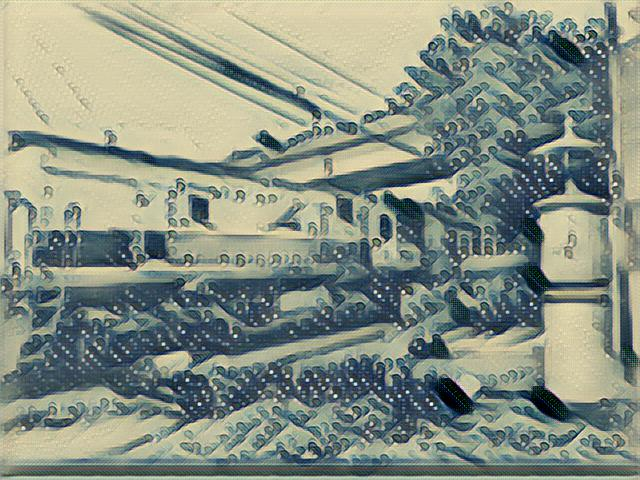
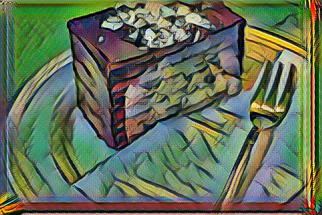
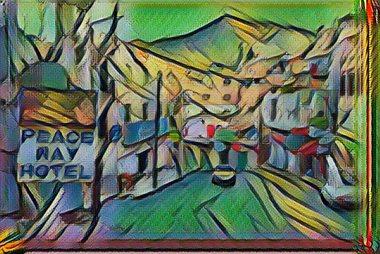
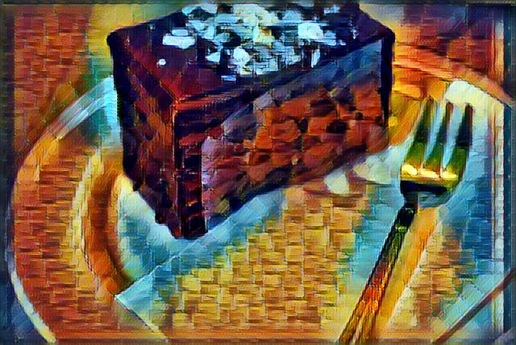
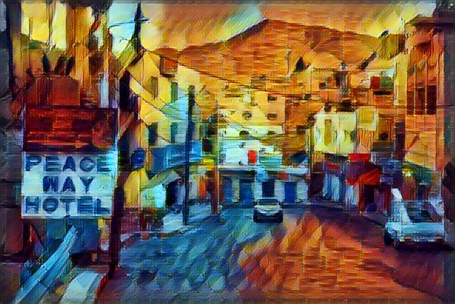

## 文章
[风格迁移原理与应用](https://zhuanlan.zhihu.com/p/333598084)
## 项目
[fast-style-transfer](./fast-style-transfer/project/runproject.md)

[PyTorch-Multi-Style-Transfer](./fast-style-transfer/project/runproject.md)
## 展示

#### ourself_train_wave

 

#### ourself_train_wave

 

#### pretrain_rain_princess

 