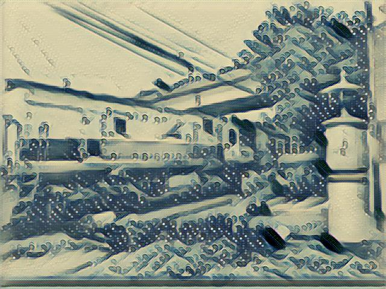
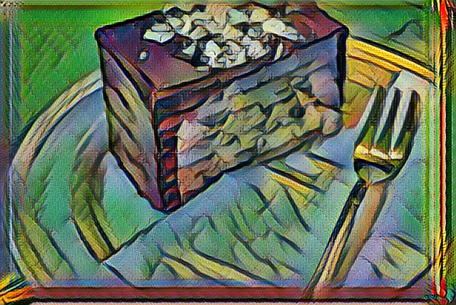
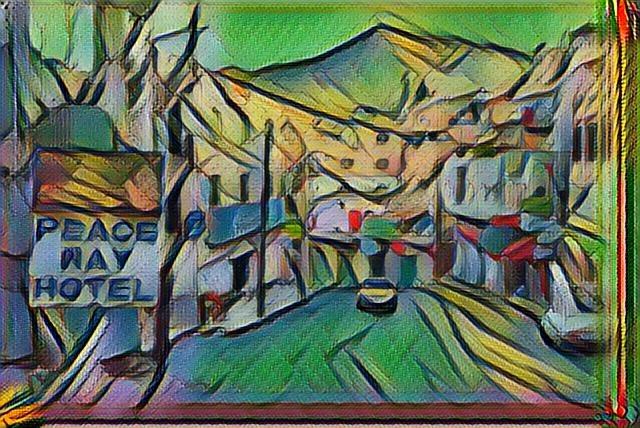
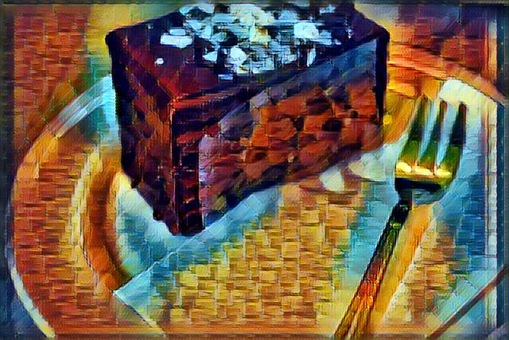
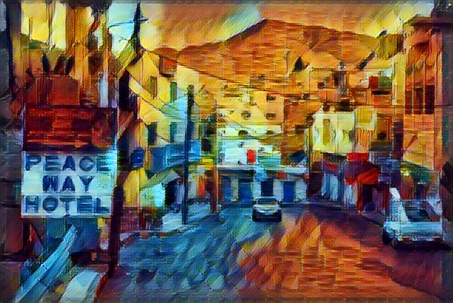

```
# python evaluate.py --checkpoint checkpoints2/ --in-path data/testjpg/ --out-path test_out --allow-different-dimensions


#  python style.py --style examples/style/wave.jpg   --checkpoint-dir checkpoint/   --test examples/content/chicago.jpg  --test-dir ./test_out   --content-weight 1.5e1   --checkpoint-iterations 10000   --batch-size 20

# python train.py

# python test.py --allow-different-dimensions

```

### 准备
将准备voc的数据集。放到`data/train2014`。
可以抽出一部分，放到testjpg。作为测试参考。

下载好vgg19的与训练模型。也放到**data**下。

```shell
data
├── bin
├── imagenet-vgg-verydeep-19.mat
├── testjpg
├── train2014
└── train2014.zip
```
下载与训练模型**[训练模型](https://drive.google.com/drive/folders/0B9jhaT37ydSyRk9UX0wwX3BpMzQ?usp=sharing)**，放到pretrain目录下，以便等下备用。

```shell
pretrain
├── la_muse.ckpt
├── rain_princess.ckpt
├── scream.ckpt
├── wave.ckpt
└── wreck.ckpt
```

### 训练

在train.py 文件中有这些参数需要你配置好。尤其是你选择的 **STYLE**,**CHECKPOINT_DIR**,**TEST_DIR**等几个目录。
要先准备好
```
mkdir checkpoints2 
mkdir test_out
```

```python
CONTENT_WEIGHT = 7.5e0
STYLE_WEIGHT = 1e2
TV_WEIGHT = 2e2

LEARNING_RATE = 1e-3
NUM_EPOCHS = 2

CHECKPOINT_ITERATIONS = 2000

BATCH_SIZE = 4
DEVICE = '/gpu:0'
FRAC_GPU = 1

STYLE = 'examples/style/wave.jpg'
TEST = 'examples/content/chicago.jpg'
TEST_DIR = './test_out'
VGG_PATH = 'data/imagenet-vgg-verydeep-19.mat'
TRAIN_PATH = 'data/train2014'
CHECKPOINT_DIR = 'checkpoints2'
```

### 测试
在 test.py文件中修改你要测试的配置参数。

```
INPATH = 'data/testjpg'
CHECKPOINT_DIR = 'checkpoints2'
OUTPATH = 'test_out_ourseltrain'
```

进行测试如果，你的所测试的图片像素，不是固定的。请加上'--allow-different-dimensions'
```
python test.py --allow-different-dimensions
```

### 展示效果

<div align = 'center'>

#### ourself_train_wave



<br>

#### ourself_train_wave




<br>

#### pretrain_rain_princess




<br>